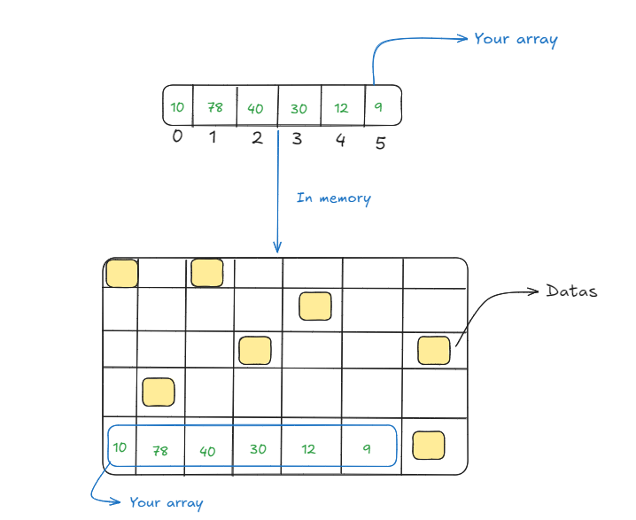

# Arrays

## An array is a data structure that stores values contiguously in memory, as shown below

Each position in the array can be access by its index in memory, it's conventional for that index start at 0, so if you want to access the value 30, for example, you need to access position 3 in the array